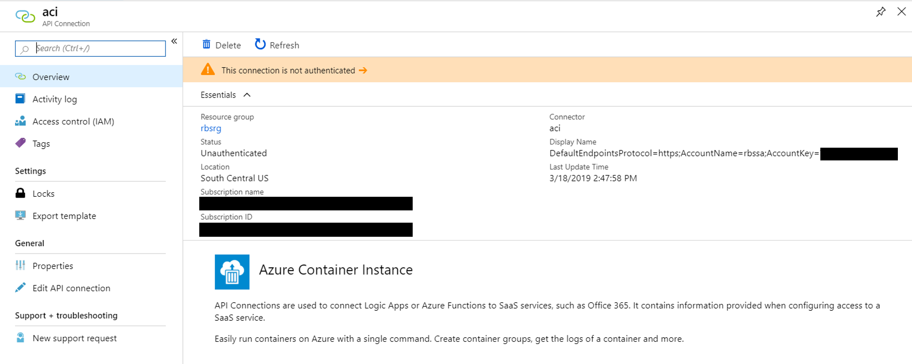

# Batch scoring on Azure with R models

## Overview

In this repository, we use the scenario of product sales forecasting to demonstrate the recommended approach for batch scoring with R models on Azure. This architecture can be generalized for any scenario involving batch scoring using R models.

## Design

The above architecture works as follows:
1. Model scoring is parallelized across a cluster of virtual machines running on Azure Batch.
2. Each Batch job reads input data from a Blob container, makes a prediction using pre-trained R models, and writes the results back to the Blob container.
3. Batch jobs are triggered by a scheduler script using the doAzureParallel R package. The script runs on an Azure Container Instance (ACI).
4. The ACI is run on a schedule managed by a Logic App.

## Forecasting scenario

This example uses the scenario of a large food retail company that needs to forecast the sales of thousands of products across multiple stores. A large grocery store can carry tens of thousands of products and generating forecasts for so many product/store combinations can be a very computationally intensive task. In this example, we generate forecasts for 1,000 products across 83 stores, resulting in 5.4 million scoring operations. The architecture deployed is capable of scaling to this challenge. See [here](forecasting_scenario.md) for more details of the forecasting scenario.

## Prerequisites

This repository has been tested on an [Ubuntu Data Science Virtual Machine](https://azuremarketplace.microsoft.com/marketplace/apps/microsoft-dsvm.linux-data-science-vm-ubuntu) which comes with many of the local/working machine dependencies pre-installed.

Local/Working Machine:
- Ubuntu >=16.04LTS (not tested on Mac or Windows)
- R >= 3.4.3
- [Docker](https://docs.docker.com/install/linux/docker-ce/ubuntu/#install-docker-ce-1)  >=1.0 (check current version with `docker version`)
- [Azure CLI](https://docs.microsoft.com/cli/azure/?view=azure-cli-latest) >=2.0 (check current version with `az --version`)

R packages (install by running `Rscript R/install_dependencies.R`):
- gbm >=2.1.4.9000
- rAzureBatch >=0.6.2
- doAzureParallel >=0.7.2
- bayesm >=3.1-1
- ggplot2 >= 3.1.0
- tidyr >=0.8.2
- dplyr >=0.7.8
- jsonlite >=1.5
- devtools >=1.13.4
- dotenv >=1.0.2
- AzureContainers >=1.0.1
- AzureGraph >= 1.0.0
- AzureStor >=2.0.1
- AzureRMR >=2.1.1.9000

You will also require an [Azure Subscription](https://azure.microsoft.com/free/).

While it is not required, [Azure Storage Explorer](https://azure.microsoft.com/features/storage-explorer/) is useful to inspect your storage account.

## Setup
Run the following in your local terminal:
1. Clone the repo `git clone <repo-name>`
2. `cd` into the repo
3. Install R dependencies `Rscript R/install_dependencies.R`
<!-- 4. Log in to Azure using the Azure CLI `az login`
5. Log in to Docker `sudo docker login` -->

## Deployment steps

Start by filling out details of the deployment in [00_resource_specs.R](./00_resource_specs.R). Then run through the following R scripts. It is intended that you step through each script line-by-line (with Ctrl + Enter if using RStudio). Before executing the scripts, set your working directory of your R session `setwd("~/RBatchScoring")`. It is recommended that you restart your R session and clear the R environment before running each script.

1. [01_generate_forecasts_locally.R](./01_generate_forecasts_locally.R)
2. [02_deploy_azure_resources.R](./02_deploy_azure_resources.R)
3. [03_forecast_on_batch.R](./03_forecast_on_batch.R)
4. [04_run_from_docker.R](./04_run_from_docker.R)
5. [05_deploy_logic_app.R](./05_deploy_logic_app.R)

After running these scripts, navigate to your resource group in the Azure portal to see the following deployed resources:

To complete the deployment, you will need to authenticate to allow the Logic App to create an ACI. Click on the ACI connector to authenticate as shown below:

Finally, you now need enable the Logic App. Go to the logic app's pane in the portal and click the Enable button to kick off its first run.

Go to the new Container instances object in your resource group and see the status of the running job in the Containers pane.

When you are finished with your deployment, you can run [06_delete_resources.R](./06_delete_resources.R) to delete the resources that were created.

# Contributing

This project welcomes contributions and suggestions.  Most contributions require you to agree to a
Contributor License Agreement (CLA) declaring that you have the right to, and actually do, grant us
the rights to use your contribution. For details, visit https://cla.microsoft.com.

When you submit a pull request, a CLA-bot will automatically determine whether you need to provide
a CLA and decorate the PR appropriately (e.g., label, comment). Simply follow the instructions
provided by the bot. You will only need to do this once across all repos using our CLA.

This project has adopted the [Microsoft Open Source Code of Conduct](https://opensource.microsoft.com/codeofconduct/).
For more information see the [Code of Conduct FAQ](https://opensource.microsoft.com/codeofconduct/faq/) or
contact [opencode@microsoft.com](mailto:opencode@microsoft.com) with any additional questions or comments.