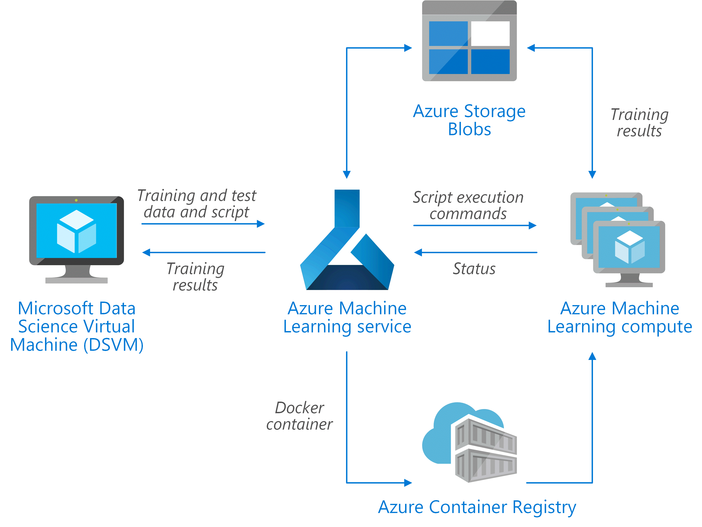

### Author: Mario Bourgoin

# Training of Python scikit-learn models on Azure

## Overview

This scenario shows how to tune a Frequently Asked Questions (FAQ) matching model that can be deployed as a web service to provide predictions for user questions. For this scenario, "Input Data" in the architecture diagram refers to text strings containing the user questions to match with a list of FAQs. The scenario is designed for the Scikit-Learn machine learning library for Python but can be generalized to any scenario that uses Python models to make real-time predictions.

## Design


The scenario uses a subset of Stack Overflow question data which includes original questions tagged as JavaScript, their duplicate questions, and their answers. It tunes a Scikit-Learn pipeline to predict the match probability of a duplicate question with each of the original questions. The application flow for this architecture is as follows:

1. Create an Azure ML Service workspace.
2. Create an Azure ML Compute cluster.
3. Upload training, tuning, and testing data to Azure Storage.
4. Configure a HyperDrive random hyperparameter search.
5. Submit the search.
6. Monitor until complete.
7. Retrieve the best set of hyperparameters.
8. Register the best model.

## Prerequisites

1. Linux (Ubuntu).
2. [Anaconda Python](https://www.anaconda.com/download) installed.
3. [Azure account](https://azure.microsoft.com).

The tutorial was developed on an [Azure Ubuntu
DSVM](https://docs.microsoft.com/en-us/azure/machine-learning/data-science-virtual-machine/dsvm-ubuntu-intro),
which addresses the first two prerequisites.  You can allocate such a
VM on [Azure Portal](https://portal.azure.com) by creating a "Data
Science Virtual Machine for Linux (Ubuntu)" resource.

## Setup

To set up your environment to run these notebooks, please follow these steps.  They setup the notebooks to use Azure seamlessly.

1. Create a _Linux_ _Ubuntu_ VM.
2. Log in to your VM.  We recommend that you use a graphical client
   such as
   [X2Go](https://docs.microsoft.com/en-us/azure/machine-learning/data-science-virtual-machine/dsvm-ubuntu-intro#x2go)
   to access your VM.  The remaining steps are to be done on the VM.
3. Open a terminal emulator.
4. Clone, fork, or download the zip file for this repository:
   ```
   git clone https://github.com/Microsoft/MLHyperparameterTuning.git
   ```
5. Enter the local repository:
   ```
   cd MLHyperparameterTuning
   ```
6. Create the Python MLHyperparameterTuning virtual environment using the environment.yml:
   ```
   conda env create -f environment.yml
   ```
7. Activate the virtual environment:
   ```
   source activate MLHyperparameterTuning
   ```
   The remaining steps should be done in this virtual environment.
8. Login to Azure:
   ```
   az login
   ```
   You can verify that you are logged in to your subscription by executing
   the command:
   ```
   az account show -o table
   ```
9. If you have more than one Azure subscription, select it:
   ```
   az account set --subscription <Your Azure Subscription>
   ```
10. Start the Jupyter notebook server:
	```
	jupyter notebook
	```

## Steps

After following the setup instructions above, run the Jupyter notebooks in order starting with [00_Data_Prep_Notebook.ipynb](https://github.com/Microsoft/MLHyperparameterTuning/blob/master/00_Data_Prep.ipynb).

## Cleaning up

The [last Jupyter notebook](07_Tear_Down.ipynb) describes how to delete the Azure resources created for running the tutorial. Consult the [conda documentation](https://docs.conda.io) for information on how to remove the conda environment created during the setup.  And if you created a VM, you may also delete it.

## Contributing

This project welcomes contributions and suggestions.  Most contributions require you to agree to a Contributor License Agreement (CLA) declaring that you have the right to, and actually do, grant us the rights to use your contribution. For details, visit https://cla.microsoft.com.

When you submit a pull request, a CLA-bot will automatically determine whether you need to provide a CLA and decorate the PR appropriately (e.g., label, comment). Simply follow the instructions provided by the bot. You will only need to do this once across all repos using our CLA.

This project has adopted the [Microsoft Open Source Code of Conduct](https://opensource.microsoft.com/codeofconduct/). For more information see the [Code of Conduct FAQ](https://opensource.microsoft.com/codeofconduct/faq/) or contact [opencode@microsoft.com](mailto:opencode@microsoft.com) with any additional questions or comments.
